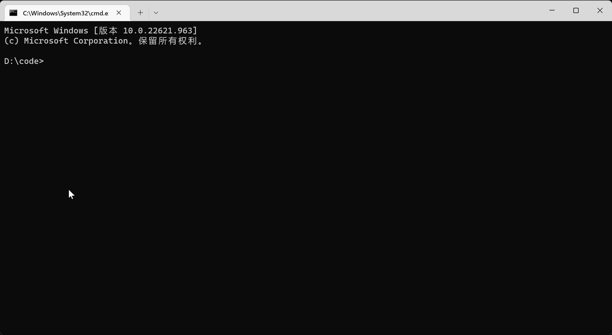

<h1 align="center">Welcome to @feiyuhao/vite_cli 👋</h1>
<p>
  <a href="https://www.npmjs.com/package/@feiyuhao/vite_cli" target="_blank">
    
  </a>
  
  <a href="https://github.com/kongxiangyiren/vite_cli#readme" target="_blank">
    
  </a>
  <a href="https://github.com/kongxiangyiren/vite_cli/graphs/commit-activity" target="_blank">
    
  </a>
  <a href="https://github.com/kongxiangyiren/vite_cli/blob/master/LICENSE" target="_blank">
    
  </a>
</p>

> vite vue3 脚手架 自用

> 从 4.0.0 开始,不在使用 [create-vite](https://www.npmjs.com/package/create-vite) 拉取代码,改用 [create-vue](https://www.npmjs.com/package/create-vue) , 如果没有什么特别需求，推荐还是用 [create-vue](https://www.npmjs.com/package/create-vue)

### 🏠 [Homepage](https://github.com/kongxiangyiren/vite_cli#readme)

## Prerequisites

- node ^14.18.0 || >=16.0.0

## Install

```sh
npm install @feiyuhao/vite_cli --global
```

## Usage

### 创建项目

```sh
vc create
```

### 创建自动化

```sh
vc deploy
```

### 查看版本

```sh
vc -v
```



## UnInstall

````sh
npm uninstall @feiyuhao/vite_cli --global
```vue3 create
````

## Author

👤 **空巷一人**

- Github: [@kongxiangyiren](https://github.com/kongxiangyiren)

## 🤝 Contributing

Contributions, issues and feature requests are welcome!<br />Feel free to check [issues page](https://github.com/kongxiangyiren/vite_cli/issues).

## Show your support

Give a ⭐️ if this project helped you!

## 📝 License

Copyright © 2023 [空巷一人](https://github.com/kongxiangyiren).<br />
This project is [MIT](https://github.com/kongxiangyiren/vite_cli/blob/master/LICENSE) licensed.

---

_This README was generated with ❤️ by [readme-md-generator](https://github.com/kefranabg/readme-md-generator)_
